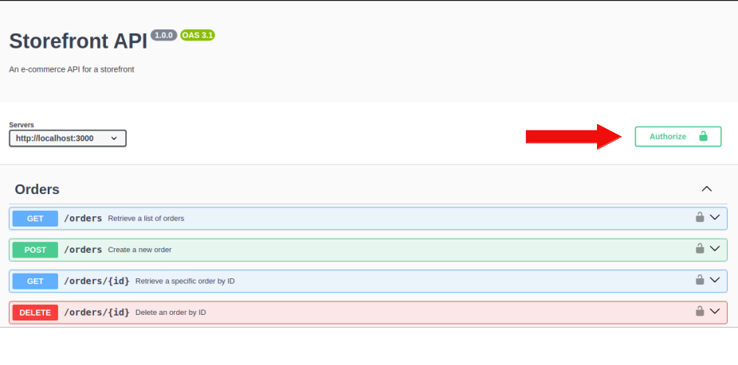

# Storefront API

Storefront API is a service designed to support the basic operations of e-commerce. It allows users to create an account, sign in, and add products to their shopping cart. The API is crafted using `Express` and `TypeScript`, while the automated tests rely on `Jasmine`.

## Prerequisites
- Docker
- Ensure ports 5432 and 5433 are available on your system.

## Technical Overview

- **Backend Framework**: Express.js
- **Programming Language**: TypeScript
- **Automated Testing**: Jasmine

## Getting Started

Follow these steps to get the service up and running:

### I. Preliminary Setup

#### 1.1 Clone the Repository

```bash
git clone https://github.com/Fbossio/storefront-api.git
```

#### 1.2 Rename the Configuration File

Navigate to the project root and rename the 'example.env' file to '.env'.

#### 1.3 Check Port Availability

Ensure that ports 5432 and 5433 are available on your system.


### II. Running Automated Tests

#### 2.1 Start the Test Database Container

```bash
docker compose -f docker-compose.test.yml up
```
#### 2.2 Execute the Tests

Once the container is fully up, open another terminal at the project root and execute:

```bash
npm run test
```

### III. Running the Service in Development Mode

#### 3.1 Start the Development Database Container

```bash
docker compose -f docker-compose.yml up
```

#### 3.2 Launch the Service

After the container is fully initialized, open another terminal and run:

```bash
npm start
```


## Manual Testing

Once the service is running in development mode, navigate to the following URL where the 'Swagger' UI is hosted:

http://localhost:3000/api-docs


To utilize the interface and test all routes, follow these steps:

1. Go to the *Users* section. Select the 'POST /signup' endpoint. Click the *try it out* button.


2. You can modify the default values in the 'request body' or leave them as they are. Hit the 'execute' button.


3. Navigate to the 'POST /signin' endpoint and sign in with the user you just created. If you retained the default values in the previous step, there's no need to modify them here.


4. Click the 'execute' button.


5. The service will return a 'JsonWebToken'. Copy it, excluding the quotation marks.


6. Click the *Authorize* button at the top right corner.



7. In the popup window, paste the 'JsonWebToken' and hit *Authorize*.


8. This will enable you to send requests to all protected endpoints.
