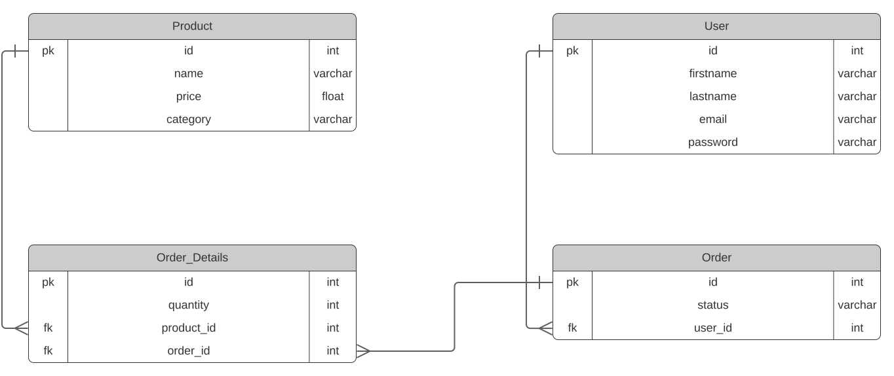

# API Requirements
The company stakeholders want to create an online storefront to showcase their great product ideas. Users need to be able to browse an index of all products, see the specifics of a single product, and add products to an order that they can view in a cart page. You have been tasked with building the API that will support this application, and your coworker is building the frontend.

These are the notes from a meeting with the frontend developer that describe what endpoints the API needs to supply, as well as data shapes the frontend and backend have agreed meet the requirements of the application. 

## API Endpoints
#### Products
- Index 
- Show
- Create [token required]
- [OPTIONAL] Top 5 most popular products 
- [OPTIONAL] Products by category (args: product category)

#### Users
- Index [token required]
- Show [token required]
- Create N[token required]

#### Orders
- Current Order by user (args: user id)[token required]
- [OPTIONAL] Completed Orders by user (args: user id)[token required]

## Data Shapes
#### Product
-  id
- name
- price
- [OPTIONAL] category

#### User
- id
- firstName
- lastName
- password

#### Orders
- id
- id of each product in the order
- quantity of each product in the order
- user_id
- status of order (active or complete)

## RESTful Routes
### Products

```bash
# Get a list of all products
GET /products
```
```bash
# Get the detail of a product
GET /products/:id
```

```bash
# Create a product
# Token required
POST /products
```

```bash
# Delete a product
# Token required
DELETE /products/:id
```

```bash
# Update a product
# Token required
PUT /products/:id
```

```bash
# Get the top five products
GET /top_products
```

### Users

```bash
# Register a user
POST /signup
```

```bash
# Login a user
POST /signin
```

```bash
# Create a user
# Token required
POST /users
```

```bash
# Get the details of a user
# Token required
GET /users/:id
```


### Orders

```bash
# Get a list of orders
# Token required
GET /orders
```

```bash
# Get an order
# Token required
GET /orders/:id
```

```bash
# Create an order
# Token required
POST /orders
```

```bash
# Delete an order
# Token required
DELETE /orders/:id
```

```bash
# Change the status of an order
# Token required
PUT /orders/:id
```

```bash
# Add a product to an order
# Token required
POST /orders/:id/products
```

```bash
# Get the products of a specific order
# Token required
GET /orders/:id/products
```

```bash
# Delete a product from an order
# Token required
DELETE /orders/:id/products
```


## Database Design



The database design comprises four main entities: **Product**, **User**, **Order**, and **Order_Details**. Below is a detailed explanation of each entity and the relationships between them:

1. **Product Entity**
- **Attributes**:
    - **id** (Primary Key): An integer that uniquely identifies each product.
    - **name**: A varchar type indicating the name of the product.
    - **price**: A float type representing the price of the product.
    - **category**:  A varchar type that describes the category to which the product belongs.

This entity is responsible for maintaining all the details related to the products available in the system.

2. **User Entity**
- **Attributes**:
    - **id** (Primary Key): An integer that uniquely identifies each user.
    - **firstname**: A varchar type indicating the user's first name.
    - **lastname**: A varchar type representing the user's last name.
    - **email**: A varchar type detailing the user's email address.
    - **password**: A varchar type for storing the user's password.

This entity holds all the information pertaining to registered users of the system.

3. **Order Entity**
- **Attributes**:
    - **id** (Primary Key): An integer that uniquely identifies each order.
    - **status**: A varchar type representing the current status of the order.
    - **user_id** (Foreign Key): An integer that references the id from the **User** entity.

This entity tracks all orders made by users. Each order is associated with one user through the **user_id** foreign key.

4. **Order_Details Entity**
- **Attributes**:
    - **id** (Primary Key): An integer that uniquely identifies each order detail.
    - **quantity**: An integer indicating the number of items for a particular product in the order.
    - **product_id** (Foreign Key): An integer that references the id from the **Product** entity.
    - **order_id** (Foreign Key): An integer that references the id from the **Order** entity.

This entity represents the details of an order, including which products were ordered and in what quantity. Each order detail is linked to both a product and an order.

**Relationships**
    - The **Order** entity and **User** entity are connected through a one-to-many relationship via the *user_id* foreign key. One user can place multiple orders, but each order is associated with only one user.
    - The **Order_Details** entity bridges the **Product** and **Order** entities. It has a many-to-one relationship with both entities via the *product_id* and *order_id* foreign keys. This means that each order can have multiple products, and each product can be part of multiple orders, with quantities specified in the **Order_Details** entity.